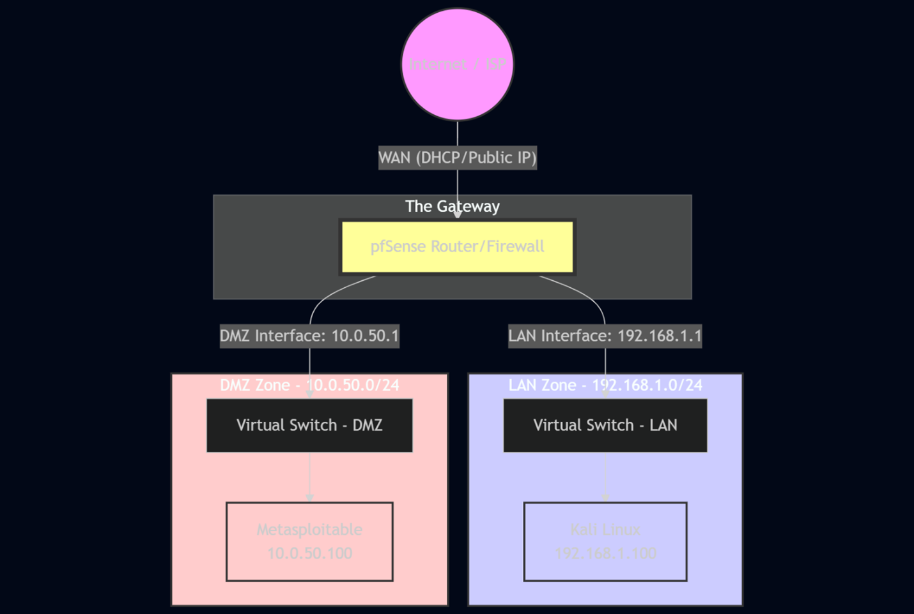
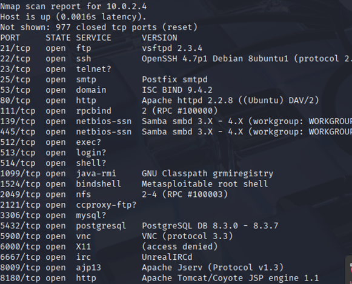

The objective of this project was to transition from a basic "two computers connected" setup to a professionally segmented network with a dedicated security gateway. Using pfSense, I established a functional, isolated attack environment to identify a target's exposed services while maintaining strict control over cross-zone communication.

1. Network Architecture & Design
I implemented a three-tier architecture to ensure logical isolation between the attack node and the vulnerable target. 

WAN Interface: Connected via DHCP to provide the gateway with internet access.

LAN Zone (192.168.1.0/24): The trusted zone housing the Kali Linux attack machine.

DMZ Zone (10.0.50.0/24): The untrusted zone housing the Metasploitable target.

2. Vulnerability Assessment (Phase 1)
Before implementing defense layers, I conducted an initial reconnaissance of the target. An Nmap scan revealed a high-risk profile with numerous open ports, including FTP, SSH, and various backdoors (e.g., bindshell on port 1524), establishing the need for robust network-level filtering.

 

3. Firewall Implementation (Phase 2)
I utilized pfSense to enforce a Default Deny security posture, ensuring that no traffic could move between subnets unless explicitly permitted.

Default Deny Evidence
Initially, all traffic from the Kali node (LAN) to the Metasploitable node (DMZ) was blocked by the firewall, resulting in 100% packet loss.

 

Rule Configuration & Connectivity Proof
To allow for controlled testing, I created a specific firewall rule on the LAN interface allowing IPv4 ICMP traffic to the OPT1 (DMZ) subnet. After applying this rule, connectivity was verified through a successful five-packet ping exchange.

  

4. Intrusion Detection System (Phase 3)
To provide deep packet inspection, I deployed Suricata IDS on the LAN interface.

Alert Analysis
During the project, Suricata successfully identified and logged several security events:

ET INFO Possible Kali Linux hostname: Detected an attacker-specific OS joining the network via DHCP requests.

SURICATA Applayer Mismatch: Identified anomalous protocol behavior in both directions, common during automated scanning or exploit attempts.

  

5. Technical Challenges & Optimization
Hardware Offloading: To ensure Suricata could accurately inspect raw traffic, I manually disabled Hardware Checksum Offloading, TCP Segmentation Offloading, and Large Receive Offloading within the pfSense system settings.

Interface Mapping: I correctly identified and assigned the virtual network adapters to ensure the internal network zones (LAN and OPT1) remained air-gapped from the host machine.

Technical Competency Mapping
Apple Requirement,Lab Component
Networking Protocols,Implemented segmented IPv4 subnets (192.168.1.0/24 and 10.0.50.0/24) and managed ICMP traffic via pfSense. 
Analytical Thinking,"Diagnosed and resolved ""Protocol Mismatch"" and ""DHCP Hostname"" alerts using Suricata signature analysis. "
Hardware/Software Integration,Configured VirtualBox internal networking and optimized pfSense kernel settings (disabling Hardware Offloading) for IDS stability. 
Security Principles,"Enforced a ""Default Deny"" posture and validated the ""Principle of Least Privilege"" through firewall rule testing. "# Network-Defense-Lab
